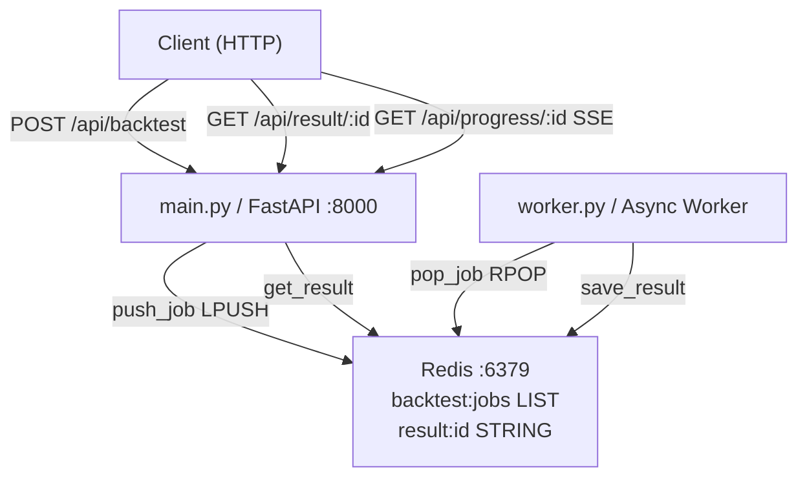
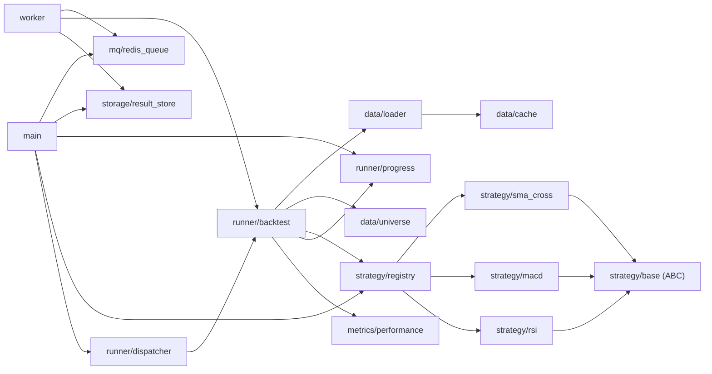
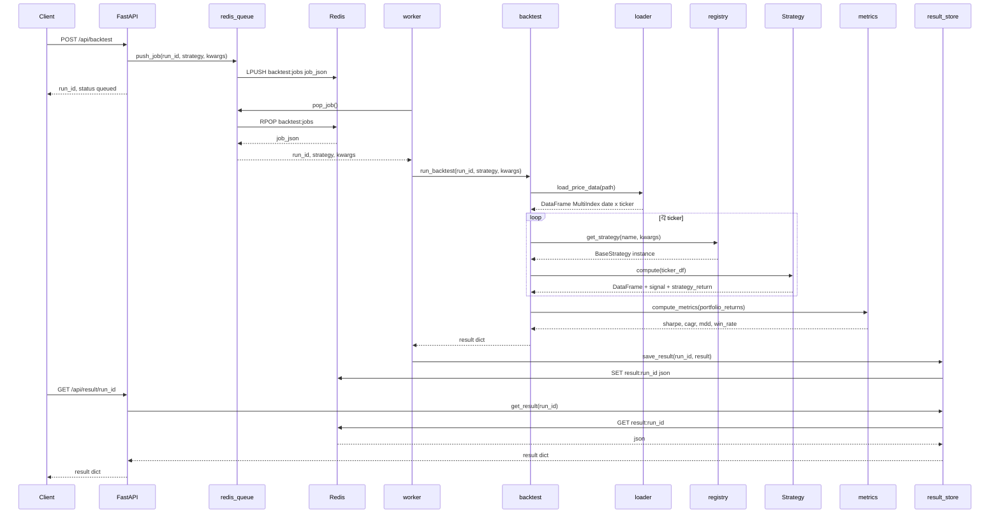

# alpha-pipeline

## 프로젝트 목적 및 기능

퀀트 전략 백테스팅 내부 연구 시스템 (라이브 거래 X)

- FastAPI HTTP API + Redis 메시지 큐 + 비동기 Worker의 분산 아키텍처
- SMA Cross / MACD / RSI 3가지 전략 지원
- SSE(Server-Sent Events)로 실시간 진행률 스트리밍
- Sharpe Ratio, CAGR, Max Drawdown, Win Rate, Volatility 등 성과 지표 계산
- 여러 전략 동시 비교 (`/api/compare`)
- Docker Compose 기반 컨테이너 배포

---

## 아키텍처

### 시스템 구성 (C4 Container 수준)

### 모듈 의존 관계

### 모듈별 역할

| 모듈 | 역할 |
|---|---|
| `config.py` | Pydantic Settings 싱글턴 |
| `main.py` | FastAPI 앱, 5개 엔드포인트 |
| `worker.py` | Redis 큐 소비 루프 |
| `data/loader.py` | CSV 로드·검증·daily_return 계산 |
| `data/cache.py` | 프로세스 내 DataFrame 캐시 |
| `data/universe.py` | 거래 가능 ticker 목록 반환 |
| `strategy/base.py` | BaseStrategy 추상 클래스 |
| `strategy/sma_cross.py` | SMA 크로스오버 전략 |
| `strategy/macd.py` | MACD 전략 |
| `strategy/rsi.py` | RSI 전략 |
| `strategy/registry.py` | 전략 등록·인스턴스 캐시 |
| `runner/backtest.py` | 메인 백테스트 실행 로직 |
| `runner/dispatcher.py` | 다중 전략 동시 실행 |
| `runner/job_queue.py` | 로컬 테스트용 인메모리 큐 (분산 환경 미사용) |
| `runner/progress.py` | SSE 진행률 상태 관리 |
| `metrics/performance.py` | Sharpe·CAGR·MDD 등 계산 |
| `storage/result_store.py` | Redis 결과 저장/조회 |
| `mq/redis_queue.py` | Redis 기반 분산 잡 큐 |

---

## 데이터 흐름

### 단일 백테스트 실행 흐름

### 핵심 데이터 구조

| 구조 | 형태 | 주요 필드 |
|---|---|---|
| Price DataFrame | MultiIndex (date, ticker) | open, high, low, close, volume, daily_return |
| Strategy DataFrame | Price DF 확장 | + signal(int), turnover, strategy_return |
| Job dict (Redis) | JSON STRING | run_id, strategy, kwargs |
| Result dict (Redis) | JSON STRING | run_id, sharpe_ratio, cagr, max_drawdown, win_rate, total_return, volatility_annual, num_days |
| Progress event (SSE) | JSON | run_id, step, pct, ticker |